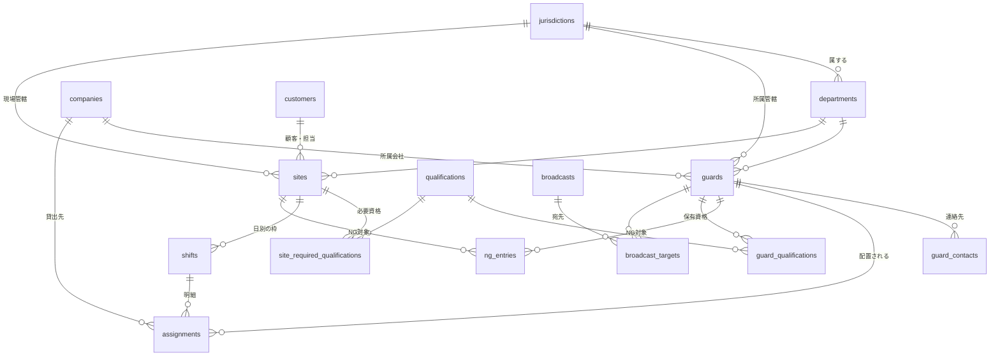

# データモデル（ER）― 第1弾：管制／配置管理

**作成日**：2026-08-28
**前提**：`architecture-decision.md`（①スクラッチ／Next.js＋Supabase／AS 単独利用）
**出典**：`shiftmax-api-analysis.md`（ShiftMax 側の確定構造）＋ 8/27 管制ヒアリング

---

## 0. 設計方針

| # | 方針 | 理由 |
|---|---|---|
| 1 | **単一組織前提。`org_id` を持たない** | AS 単独利用・委託先はログインしない（決定5） |
| 2 | **ShiftMax の項目名・コード体系を尊重する** | 投入CSV18項目に変換できることが第1弾の完成条件 |
| 3 | **応援は専用テーブルを作らない**（§2） | 管轄・所属会社の差分で自然に表現できる |
| 4 | **日跨ぎ勤務は `work_date` ＝「開始日」** | 夜勤がある。警備番頭も同じ扱い（本番実測で日跨ぎ band が21本） |
| 5 | **JST は DB 側で明示する**（`at time zone 'Asia/Tokyo'`） | Vercel の実行環境は UTC。警備番頭で実証済みの型 |
| 6 | **監査ログは汎用トリガーで後付けする** | 書き忘れによる記録漏れを防ぐ（警備番頭から流用） |
| 7 | **マイナンバー・口座情報は持たない** | 第1弾スコープ外。要件が跳ね上がるため |

---

## 1. ER 図



---

## 2. 応援（他管轄・協力会社）の表現 ― 専用テーブルを作らない

8/27 で「**応援は双方向**」が要件として確定した。
警備番頭の `sub_links` は**レガシーIDと組織の対応表**であり、
委託先がログインする前提のため**流用しない**（決定5の要精査1の結論）。

**代わりに、差分で表現する。**

| 応援の種類 | 表現 | 可否の制御 |
|---|---|---|
| **他管轄から借りる**（他管轄の隊員を自管轄の現場へ） | `assignments` で<br>`guard.jurisdiction_id ≠ site.jurisdiction_id` | `jurisdictions.allow_cross_staff` |
| **他管轄へ貸す**（自管轄の隊員を他管轄の現場へ） | 同上（**同じ1行が、見る向きで貸し／借りになる**） | `jurisdictions.allow_cross_site` |
| **協力会社から借りる** | `guard.company_id` が `kind='partner'` の会社 | `companies.kind` |
| 🔴 **協力会社へ貸す**（AS の隊員を他社の現場へ） | `assignments.kind='lent_out'`<br>＋貸出先会社・外部現場名・**案件番号**・時間・**残業** | ─ |

> ✅ **双方向は「1本の配置行を、どちらの管轄から見るか」で自然に成立する。**
> 管轄マスタの2フラグ（`他管轄社員配置` / `他管轄現場配置`）は
> **ShiftMax に実在する列**であり（`shiftmax-api-analysis.md` §7-4）、
> **業務側が既にこの考え方で運用している**ことの裏付けでもある。

> 🔴 **「協力会社へ貸す」は請求に関わる**（2026-08-28 判明）。
> 相手先の現場は自社マスタに無いが、**案件情報と勤務情報（残業含む）を後から請求に使える形で持つ**。
> → §4-2 で `assignments` に統合した。

---

## 3. マスタ

### 3-1. `jurisdictions`（管轄）

ShiftMax 由来（§7-4）。

| 列 | 型 | 備考 |
|---|---|---|
| `id` | uuid | PK |
| `code` | text | 管轄コード（ShiftMax） |
| `name` | text | 管轄表示 |
| `allow_cross_staff` | boolean | **他管轄社員配置**（他管轄の隊員を受け入れてよいか） |
| `allow_cross_site` | boolean | **他管轄現場配置**（自管轄の隊員を他管轄へ出してよいか） |

### 3-2. `departments`（部署）

`code` / `name` / `jurisdiction_id`（部署は管轄に属する）。ShiftMax 由来。

### 3-3. `companies`（会社）★新規

🔴 **ShiftMax に存在しない。新システムが持つ。**

| 列 | 型 | 備考 |
|---|---|---|
| `id` | uuid | PK |
| `name` / `name_kana` | text | |
| `kind` | text | `own`（AS 自社）／ `partner`（協力会社） |
| `contact_name` / `contact_phone` | text | 業務委託書の生成に使う |
| `status` | text | `active` / `inactive` |

### 3-4. `guards`（隊員）

**警備番頭 `guards.sql` の構造を流用**（`org_id` → `company_id` に置換）。

| 列 | 型 | 出所 |
|---|---|---|
| `id` | uuid | PK |
| `staff_code` | text | **個人コード**（ShiftMax。投入CSV必須） |
| `guard_no` | text | **隊員ナンバー**（ShiftMax。投入CSV必須） |
| `name` / `short_name` / `name_kana` | text | 個人名 / 略称 / フリガナ |
| `jurisdiction_id` / `department_id` | uuid | ShiftMax 由来 |
| **`company_id`** | uuid | ★**所属会社**（自社／協力会社） |
| `email` | text | ShiftMax にある唯一の連絡先 |
| `employment_type` | text | `employee` / `part_time` / `partner`（警備番頭の check を拡張） |
| ~~`qualifications`~~ | ~~text[]~~ | 🔴 **廃止（8/28）。`guard_qualifications` テーブルへ**（§5-2）<br>理由：資格が請求に関わるため**有効期限**が必要 |
| `status` | text | `active` / `inactive` |
| `note` | text | |

> 🔴 **協力会社の隊員は `staff_code` / `guard_no` を持たない。**
> ShiftMax に登録が無いため（8/28 判明）。**両列は nullable** とする。
> ShiftMax 投入時にどう扱うかは**ベンダ確認事項 B-10** の回答待ち。

### 3-5. `guard_contacts`（連絡先）★新規

🔴 **ShiftMax に電話・LINE は無い**（メールのみ・8/28 判明）。新システムが持つ。

| 列 | 型 | 備考 |
|---|---|---|
| `guard_id` | uuid | |
| `kind` | text | `phone` / `line` / `email` / `other` |
| `value` | text | |
| **`reachable`** | boolean | 🔴 **到達可否。「LINE が繋がらない隊員が約4割」を管理するための列** |
| `is_primary` | boolean | 一斉連絡の既定の宛先 |

### 3-6. `customers`（得意先）

ShiftMax 由来（§7-3）。主キーは顧客ではなく**担当コード**。

`staff_code`（担当コード）/ `jurisdiction_id` / `department_id` / `name`（顧客名）/ `name_kana` /
`contact_name`（担当名）/ `billing_no`（請求番号）/ `billing_name`（請求名）

### 3-7. `sites`（現場＝勤務マスタ）

ShiftMax 由来（§7-2・25項目）。🔴 **時間・班・請求先まで現場が持つ**のが本モデルの要。

| 列 | 出所 |
|---|---|
| `site_code`（現場コード）／ `guard_target_no`（**警備先番号**＝入力キー） | ShiftMax |
| `name` / `short_name` / `name_kana` / `address` | ShiftMax |
| `band_name`（班名） | ShiftMax |
| `plan_start_h` / `plan_start_m` / `plan_end_h` / `plan_end_m` / `plan_break` | ShiftMax（**予定値のひな形**） |
| `has_plan`（勤務予定フラグ） | ShiftMax |
| `customer_id` / `billing_no` | ShiftMax |
| `jurisdiction_id` / `department_id` | ShiftMax |

> ✅ **警備先番号を1つ打てば、現場名・時間・班・請求先が埋まる。**
> 現行のべんり君の体験そのもの。この入力キーの位置づけは維持する。

---

## 4. 配置（A表の本体）

### 4-1. `shifts`（配置枠）＝ A表の1行

| 列 | 型 | 備考 |
|---|---|---|
| `id` | uuid | |
| `site_id` | uuid | |
| `work_date` | date | 🔴 **日跨ぎ勤務では「開始日」** |
| `jurisdiction_id` | uuid | 投入が「日付×管轄」単位のため冗長に持つ（`sites` からトリガーで埋める） |
| `headcount` | int | **人数**（A表の入力項目） |
| `start_h` / `start_m` / `end_h` / `end_m` / `break_min` | int | 既定値は `sites` の予定値。**枠ごとに上書き可** |
| `band_name` | text | 班名 |
| `plan_comment` | text | 予定コメント |
| `billing_note` | text | 請求備考 |
| **`status`** | text | 🔴 **`draft`（仮組み）／ `confirmed`（確定）** |
| `confirmed_at` / `confirmed_by` | | WB で決定 → A表に上書き、の時点を記録 |

> ✅ **「A表は仮組みと確定の2役」を、別テーブルではなく `status` 1列で表す。**
> 8/27 の「入力画面は1画面で仮組み→確定を扱う」に対応する。

### 4-2. `assignments`（稼働）＝ 隊員がその日「何をしているか」

🔴 **2026-08-28 変更。** 当初は「配置明細」と「非現場ステータス」を別テーブルにしていたが、
**協力会社への貸出が請求に関わる**ことが判明したため、**隊員の稼働を1テーブルに統合**する。

**1行 = 隊員1名 × 稼働1件。** 同じ日に複数行を持てる（日勤＋夜勤・途中交代）。

| 列 | 型 | 備考 |
|---|---|---|
| `id` | uuid | |
| `guard_id` | uuid | |
| `work_date` | date | 🔴 日跨ぎは**開始日** |
| **`kind`** | text | 🔴 `site`（自社現場）／ `lent_out`（**協力会社へ貸出**）／ `off`（非現場） |
| `shift_id` | uuid **null可** | `kind='site'` のときのみ |
| `start_at` / `end_at` | timestamptz | **全 kind 共通で持つ**（JST は DB 側で解決） |
| `break_min` | int | 休憩 |
| **`overtime_min`** | int | 🔴 **残業。請求に使うため第1弾から持つ** |
| `role` | text | `leader` / `sub` / `member`（`kind='site'`） |
| `is_long_distance` | boolean | 遠距離（書式ではなくフラグで持つ） |
| `position` | int | プレートの並び順 |
| **`lent_to_company_id`** | uuid **null可** | 🔴 貸出先の協力会社（`kind='lent_out'`） |
| **`external_site_name`** | text **null可** | 🔴 貸出先の現場名（自社 `sites` に無いため） |
| **`external_case_no`** | text **null可** | 🔴 貸出先の案件番号・伝票番号（請求の突合キー） |
| `off_kind` | text **null可** | `kind='off'` のとき：有給／研修・講習／健診／自欠／会欠／宿直／振替休日／管制／内勤／緊急対応要員 |
| `status` | text | `planned` / `canceled` |
| `note` | text | |

> ✅ **この統合が2つの要件を同時に満たす。**
>
> | 要件 | どう満たすか |
> |---|---|
> | 🔴 **応援中と気づかず自社案件に配置する事故を防ぐ** | `guard_id + work_date` で**1テーブルを引くだけ**で、<br>自社配置・貸出・休みが**すべて見える**。見落とす経路が無い |
> | 🔴 **貸出を請求に使える形で後から抽出する** | `kind='lent_out'` を期間で絞れば、<br>**相手先・案件番号・時間・残業**が揃って出る |

#### 🔴 重複配置の防止（DB で担保する）

「1隊員が同じ日に複数の配置を持つ」ため `unique(guard_id, work_date)` は張れない。
代わりに **PostgreSQL の EXCLUDE 制約で「時間帯の重なり」を禁止**する。

```sql
-- 確定済みの稼働どうしは、同じ隊員で時間帯が重なってはならない
alter table public.assignments
  add constraint assignments_no_overlap
  exclude using gist (
    guard_id with =,
    tstzrange(start_at, end_at) with &&
  ) where (status = 'planned' and is_confirmed);
```

| | 理由 |
|---|---|
| ✅ | **アプリ側で重複チェックを書くより単純で、抜け道がない**（設計原則1・2に適合） |
| ✅ | **仮組み（`draft`）の段階では重ねられる。** 確定時にだけ効かせる<br>→ 仮組み中は**画面で警告を出すにとどめる**（配置の完全自動化は目指さない・8/27決定） |

---

## 5. 配置の制約

### 5-1. `ng_entries`（NGリスト）★新規

🔴 ShiftMax に無い。8/27 で「**NGリストは必須**」と確定。
🔴 **2026-08-28 変更：「人 × 人」の NG も持てる形にする。**

| 列 | 型 | 備考 |
|---|---|---|
| `id` | uuid | |
| **`kind`** | text | `site_guard`（**現場 × 隊員**）／ `guard_guard`（**隊員 × 隊員**） |
| `site_id` | uuid **null可** | `kind='site_guard'` のとき |
| `guard_id` | uuid | 主体 |
| **`counterpart_guard_id`** | uuid **null可** | `kind='guard_guard'` のとき（相手） |
| `reason_kind` | text | `supervisor_ng`（監督NG）／ `conflict`（不仲）／ `other` |
| `reason` | text | |
| `severity` | text | `block`（配置不可）／ `warn`（警告のみ） |

> 🔴 **「人 × 人」は対称として扱う。** A と B が不仲なら B と A も不仲。
> **保存は1行**とし、**検索時に両方向を見る**（重複登録を防ぐ）。
> 判定タイミングは「同じ `shift_id` に両者がいるか」。

> ✅ **配置の完全自動化は目指さない**（8/27 決定）。
> NG は**自動で弾く**のではなく、`severity` に応じて**画面上で警告を出す**のが主用途。

### 5-2. 資格 ― 🔴 配列をやめてテーブルにする

**2026-08-28 変更。** 当初は警備番頭に倣い `guards.qualifications text[]` で持つ設計だったが、
**資格の有無が請求に関わる**ことが判明したため、**有効期限を持てる形に変更**する。

> ⚠️ 設計原則1「凝った構成にしない」に反する方向の変更だが、
> **要件は資産に合わせて曲げない**（決定5の大原則）に従い、要件を優先する。
> 警備業の検定・法定講習には**有効期限があり、失効する**。
> 配列では「請求時点で有効だったか」を後から言えない。

#### `qualifications`（資格マスタ）

`code` / `name` / `has_expiry`（期限の有無）

#### `guard_qualifications`（隊員が持つ資格）

| 列 | 備考 |
|---|---|
| `guard_id` / `qualification_id` | |
| `number` | 検定番号など |
| `issued_on` / `expires_on` | 🔴 **期限。請求時点で有効だったかを言えるようにする** |

#### `site_required_qualifications`（現場が求める資格）

🟠 **持てるようにしておく。不要と分かれば後から消す**（2026-08-28 判断）。

| 列 | 備考 |
|---|---|
| `site_id` / `qualification_id` | |
| `required_count` | 何名必要か |

## 6. 連絡

| テーブル | 内容 |
|---|---|
| `broadcasts` | 一斉連絡1件（件名・本文・作成者・作成日時・状態） |
| `broadcast_targets` | 宛先（`guard_id` ＋ 使用した連絡先 ＋ 到達結果） |

> ✅ **送信チャネルそのものは作らない**（8/27 決定）。
> 第1弾は「**誰に・何を送るか**を1画面で組み立てる」ところまで。
> LINE 公式への受け渡し（コピー／CSV出力）で足りる。
> **通知チャネルは差し替え可能に抽象化**しておく。

---

## 7. ShiftMax 連携 ─ 🔴 **べんり君経由に変更**（2026-08-31）

> 🔴 **8/28 の「新システムから直接 POST」を取り下げた。**
> **新システムは ShiftMax と一切通信しない。** 認証情報も持たない。
> 引き渡しは **18列CSV を出力し、べんり君のコピー（送信機能を1本追加）が POST する**。
> 🔴 **貼り付け方式は不採用**（プレート操作が残り二重運用になる）。
> 理由と比較は `shiftmax-inquiry.md` §3、画面と実装は `screen-design.md` §3・§3-2。
>
> 🔴 **この工程の要否は未判定**（`requirements.md` §8-1）。不要と判定されたら
> **このテーブルごと消す**（配置ボード側のテーブルには影響しない）。

### `shiftmax_exports`（引き渡し履歴）

| 列 | 備考 |
|---|---|
| `work_date` / `jurisdiction_id` | **引き渡しは「日付 × 管轄」単位**（べんり君の入力単位と一致） |
| `payload` | 生成した引き渡しデータ（**18列CSV** 相当・差分確認用） |
| `handed_at` / `handed_by` | 誰がいつ引き渡したか |

- `result_code` / `message` は**持たない**（通信しないため応答が存在しない）
- 引き渡し後に `shifts` を変更したら `要 再引き渡し` として `S-01` に出す

> **このテーブルと `lib/shiftmax/` は第2弾で不要になる。**
> ディレクトリごと・テーブルごと捨てられる形に閉じておく（設計原則5）。

### 🔴 協力会社の隊員は ShiftMax へ「応援」枠として渡す

7月実データの分析（`shiftmax-api-analysis.md` §10-3）により、
**協力会社の隊員は ShiftMax にも べんり君にも個人単位で存在しない**ことが確認された。

| | 新システム | 引き渡し先（べんり君／ShiftMax） |
|---|---|---|
| 自社隊員 | `guards`（個人単位） | 個人単位 |
| **協力会社の隊員** | 🔴 **`guards` に個人単位で持つ**<br>（`company_id` が `kind='partner'`） | 🟢 **`応援` 1種に集約** |

| 効果 | |
|---|---|
| ✅ | ShiftMax の**登録枠300人（現在254人・残46人）を1人も消費しない＝追加費用ゼロ** |
| ✅ | **事務側が受け取るデータが現行と変わらない＝給与・請求への影響ゼロ** |
| ✅ | 8/27 要件（協力会社も個人単位で持つ）は**新システム側だけで満たす** |

> ✅ **`guards` に ShiftMax 側のコード列を持たせる必要はない。**
> 自社隊員はプレートを人が置く運用が残り、協力会社は `応援` 固定。
> **コード対応表を持たない＝第2弾で捨てるものが1つ減る。**

> 🟠 **前提の確認が1件残る**：「応援」プレートが実際に現場行へ置かれているか
> （7月は全日2枚が常駐＝待機分だけの可能性）。`gap-analysis.md` A-1 ⑮。

---

## 8. 設計論点の状況

### 8-1. ✅ 2026-08-28 に決着したもの

| # | 論点 | 決定 |
|---|---|---|
| 1 | 「協力会社へ**貸す**」の表現 | ✅ **`assignments.kind='lent_out'` に統合。**<br>🔴 **貸出は請求に関わる**ため、**案件番号・時間・残業**まで持つ |
| 2 | 1隊員が同じ日に複数の配置を持つか | ✅ **持つ。** 頻度は不明だが**そういう設計にしておくことが重要**。<br>→ `unique(guard_id, work_date)` は張らず、**EXCLUDE 制約で時間重複を防ぐ** |
| 3 | NG は「現場 × 隊員」だけか | ✅ **「人 × 人」もある。** `ng_entries.kind` で両方を持つ |
| 4 | 現場側の必要資格を持つか | ✅ **持てるようにしておく。不要なら後から消す**<br>→ `site_required_qualifications` |
| 5 | `ArgNenTukiHi` の書式 | 🟢 **自分で解ける**（`7.1〜7.31` シートの実データを読む）。**未実施** |
| ─ | 資格の持ち方 | 🔴 **配列 → テーブルに変更。** 請求に関わるため**有効期限**が必要（§5-2） |

### 8-2. 🔴 新たに詰めるべきこと（請求に効くため、第1弾の設計時に決める）

> **理由**：これらは第2弾（請求）のスコープだが、**第1弾のデータ設計で取りこぼすと後から復元できない**。
> 「後で足せばいい」が効かない項目に限って挙げる。

| # | 論点 | なぜ今か | 確認先 |
|---|---|---|---|
| 1 | 🔴 **`overtime_min`（残業）は誰がどこから入れるのか**<br>第1弾に**打刻が無い**＝実績データが存在しない。<br>貸出先からの報告を管制が手入力する運用か？ | 列だけ作っても**埋まらなければ請求に使えない**。<br>入力経路まで決めて初めて要件を満たす | 管制／事務 |
| 2 | 🔴 **単価・金額を第1弾で持つか**<br>「請求に使える情報」が**時間まで**なのか**金額まで**なのか | 金額を持つなら**隊員単価＝給与情報**に踏み込む。<br>個人情報の扱いが変わる（第1弾は扱わない方針） | 経営／事務 |
| 3 | 🟠 **中止（「現中」＝現着中止）の扱い**<br>現地に着いてから中止になった場合、<br>**稼働は発生している＝請求対象になりうる** | `status='canceled'` の一言では潰れる。<br>**中止でも時間が立つ**なら別の持ち方が要る | 管制（C-5・F-3） |
| 4 | 🟠 **締めのタイミングと、マスタ変更のスナップショット**<br>現場の時間・請求先が変わったとき、<br>**過去の配置は当時の値で請求すべき** | `shifts` に時間をコピーしている点は既に対応済。<br>**請求先（`billing_no`）も同様に固定するか**が未決 | 事務 |

> 1・2 は**事務側ヒアリング（9月上旬）に含める**。
> 3 は管制の未記入項目（C-5「現中」の意味・F-3「現着中止時の処理」）と**同じ論点**。既存項目に相乗りできる。

## 9. 流用するもの（警備番頭から）

| 資産 | 使い方 |
|---|---|
| `set_updated_at()` 共通トリガー関数 | そのまま |
| `guards` のテーブル構造 | `org_id` → `company_id` に置換して流用<br>（ただし `qualifications text[]` は採らず、テーブルに分ける・§5-2） |
| `audit_logs` ＋ 汎用トリガー | **ほぼそのまま**（`org_id` 列を落とす）。当日変更の追跡に十分な粒度 |
| DB 側の関数で派生値を算出する型（`calc_assignment_times`） | `sites` の予定値 → `shifts` の既定時刻に適用 |
| 派生値をトリガーで埋める型（`assignments_fill_derived`） | クライアント入力を信用しない<br>（例：`shifts.jurisdiction_id` は `sites` から引く） |
| `date-jst.ts` / `csv.ts` | JST 変換・CSV 生成。**ShiftMax 投入に直結** |

## 10. 流用しないもの

| | 理由 |
|---|---|
| `sub_links` | レガシーID対応表。**AS では管轄・所属会社の差分で応援を表現する**（§2） |
| `init_multitenant` / `org_id` / RLS の org 条件 | **AS 単独利用**。単一組織で単純に作る |
| `cases` / `case_bands` | 警備番頭のレガシー案件ミラー。AS は `sites` ＋ `shifts` |
